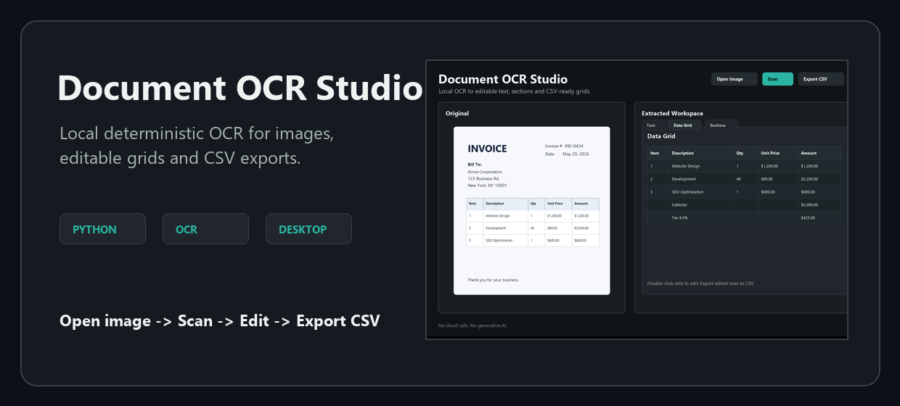

# Document OCR Studio



Local desktop OCR workspace for turning document screenshots and scanned images into editable text, structured sections, and CSV-ready tables.

Built by [Naadir](https://github.com/Naadir-Dev-Portfolio)

## Overview

Document OCR Studio is a deterministic OCR utility for invoices, forms, receipts, reports, notes, and screenshots. Drop in an image, scan it locally with Tesseract OCR, review the extracted text, edit the detected grid, and export clean CSV without any generative AI or cloud processing.

## Features

- Drag-and-drop image loading with a polished desktop document preview
- Local OpenCV preprocessing for cleaner OCR input
- Tesseract text extraction with confidence scoring
- Editable extracted text area for manual cleanup
- Excel-like data grid with double-click cell editing
- Section view for copying individual detected lines and fields
- Deterministic text-to-grid conversion for tables, key-value pairs, and delimited text
- Copy selected rows as tab-separated values for Excel or Google Sheets
- Export edited data directly to CSV

## Tech Stack

Python, Tkinter, OpenCV, Tesseract OCR, Pillow

## Setup

Install the Python dependencies:

```powershell
python -m pip install -r requirements.txt
```

Install Tesseract OCR and make sure `tesseract.exe` is available on `PATH`. If it is installed somewhere custom, set:

```powershell
$env:TESSERACT_CMD="C:\Program Files\Tesseract-OCR\tesseract.exe"
```

Run the app:

```powershell
python main.py
```

## Usage

1. Open or drop a document image.
2. Click `Scan`.
3. Edit text or grid cells if needed.
4. Use `Convert to Data` for cleaned text, `Copy` for selected sections, or `Export CSV` for a file.

## Notes

- The OCR path is local and deterministic: OpenCV image preparation plus Tesseract recognition.
- `tkinterdnd2` enables drag-and-drop. If it is missing, the app still works through `Open Image`.
- Exported CSV files are intentionally ignored by git so test exports do not pollute the repo.
