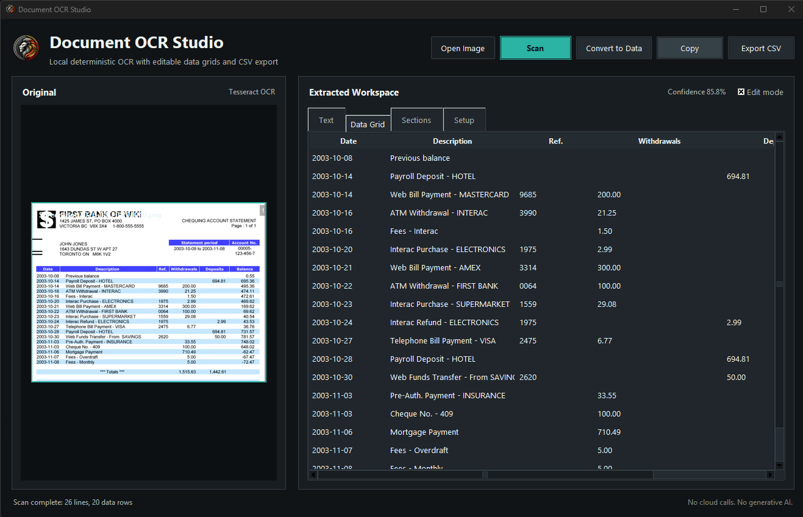
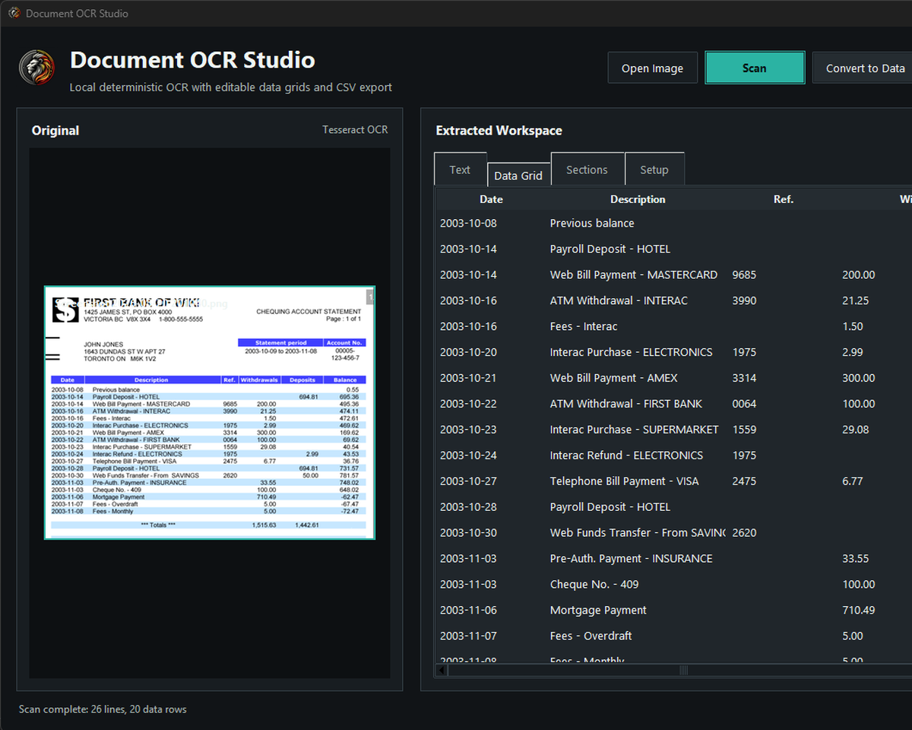
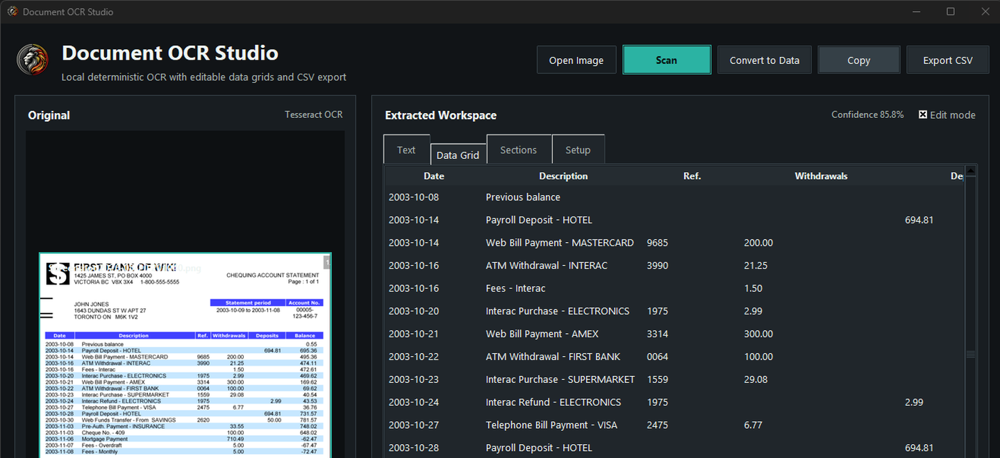

<div align="center">


<br /><br />

<p><strong>Local deterministic OCR desktop app for scanning document images into editable text, structured sections and CSV-ready grids.</strong></p>

<p>Built for people who need fast local document extraction without sending files to AI services or manually rebuilding tables by hand.</p>

<p>
  <a href="#overview">Overview</a> |
  <a href="#what-problem-it-solves">What It Solves</a> |
  <a href="#feature-highlights">Features</a> |
  <a href="#screenshots">Screenshots</a> |
  <a href="#quick-start">Quick Start</a> |
  <a href="#tech-stack">Tech Stack</a>
</p>

<h3><strong>Made by Naadir | May 2026</strong></h3>

</div>

---

## Overview

Document OCR Studio is a local desktop OCR tool for turning scanned images, screenshots, statements, receipts and forms into usable text and structured data. It uses deterministic OCR and image processing rather than generative AI, so the workflow stays local and repeatable.

The app supports a simple document workflow: drop or open an image, scan it, inspect the extracted text, review detected sections, edit grid cells and export the cleaned result to CSV. The data grid is designed for practical cleanup rather than just dumping raw OCR text.

The practical outcome is faster document-to-spreadsheet conversion. Instead of manually typing rows from an image or pasting messy OCR output into Excel, the app builds an editable table that can be corrected, copied or exported.

## What Problem It Solves

- Removes the need to retype tables and statements from screenshots or scanned document images
- Improves the manual copy-paste OCR workflow by converting text into editable grid rows
- Makes extracted sections, confidence and table structure visible before export
- Keeps the process local and deterministic instead of relying on AI tools or cloud upload workflows

### At a glance

| Track | Analyse | Compare |
|---|---|---|
| Loaded document images | OCR text, line structure and table-like regions | Raw extracted text beside editable table output |
| Image path and scan state | Confidence, detected dates, amounts, refs and key-value sections | Original document view vs cleaned grid result |
| CSV export and clipboard copy | Structured rows for Excel-ready output | OCR output vs corrected user-edited data |

## Feature Highlights

- **Local OCR scanning**, extracts text from document images using Tesseract and OpenCV without cloud calls
- **Editable data grid**, lets users correct OCR results directly before copying or exporting
- **Financial table extraction**, detects date, description, reference, withdrawals, deposits and balance columns in statement-style documents
- **Section review**, exposes detected text lines and key-value pairs so users can copy smaller parts of a document
- **Setup diagnostics**, shows copyable Windows install and PATH commands when Tesseract is missing
- **CSV workflow**, exports cleaned rows to a spreadsheet-friendly file with the edited grid state preserved

### Core capabilities

| Area | What it gives you |
|---|---|
| **OCR processing** | Local image-to-text extraction with deterministic preprocessing and confidence scoring |
| **Table reconstruction** | Cleaner rows and columns for statements, delimited text and aligned document tables |
| **Manual correction** | Double-click cell editing so imperfect OCR can be fixed before export |
| **Export and copy** | CSV output and tab-separated clipboard data ready for Excel or Google Sheets |

## Screenshots

<details>
<summary><strong>Open screenshot gallery</strong></summary>

<br />

<div align="center">
  
  <br /><br />
  
  <br /><br />
  
</div>

</details>

## Quick Start

```bash
# Clone the repo
git clone https://github.com/Naadir-Dev-Portfolio/Document-OCR-Studio.git
cd Document-OCR-Studio

# Install dependencies
python -m pip install -r requirements.txt

# Run
python main.py
```

Install the native Tesseract OCR engine before scanning. On Windows, run `winget install --id UB-Mannheim.TesseractOCR -e`, then restart the app. No API keys are required.

## Tech Stack

<details>
<summary><strong>Open tech stack</strong></summary>

<br />

| Category | Tools |
|---|---|
| **Primary stack** | `python` |
| **UI / App layer** | `tkinter`, `tkinterdnd2`, `Pillow` |
| **Data / Storage** | `CSV`, local image files, in-memory OCR results |
| **Automation / Integration** | `Tesseract OCR`, `OpenCV`, local Windows PATH diagnostics |
| **Platform** | Windows desktop, with cross-platform Python components |

</details>

## Architecture & Data

<details>
<summary><strong>Open architecture and data details</strong></summary>

<br />

### Application model

The app takes a local image file as input, builds deterministic preprocessing candidates with OpenCV, sends the best candidate through Tesseract OCR, then reconstructs text lines, sections and table rows from OCR word positions. The user reviews and edits the result in the GUI, then copies selected rows or exports the final grid to CSV.

### Project structure

```text
Document-OCR-Studio/
+-- main.py
+-- document_ocr_studio/
+-- README.md
+-- repo-card.png
+-- portfolio/
    +-- document-ocr-studio.json
    +-- document-ocr-studio.png
    +-- Screen1.png
    +-- Screen2.png
    +-- Screen3.png
```

### Data / system notes

- OCR processing is local and deterministic; no API calls or AI services are required.
- CSV exports are user-selected files and are ignored by git so test exports do not pollute the repo.
- Tesseract must be installed locally; the app includes a setup tab with Windows install and PATH guidance.

</details>

## Contact

Questions, feedback, or collaboration: `naadir.dev.mail@gmail.com`

<sub>python</sub>
